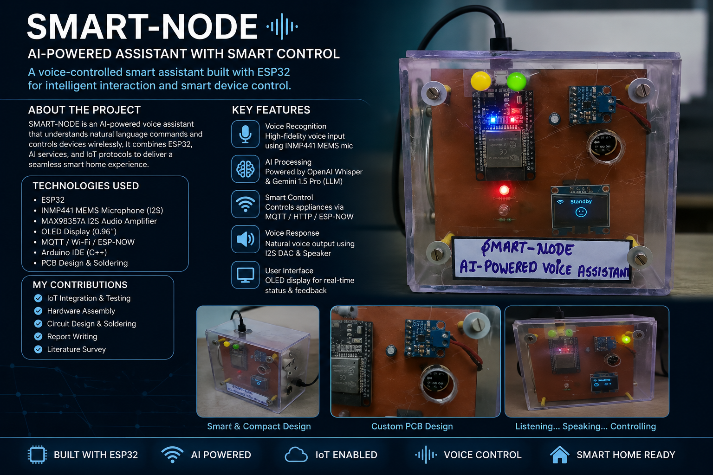

# SMART-NODE: AI-Powered Assistant with Smart Control

An ESP32-based AI-powered voice assistant designed for intelligent voice interaction and smart home automation.

## 🚀 Overview

SMART-NODE is an embedded IoT system that combines voice interaction, cloud-based AI, and wireless smart device control. The system processes natural-language voice commands and converts them into actions for connected smart devices.

## ✨ Features

- 🎤 Voice command input using an I2S MEMS microphone
- 🤖 AI-powered natural language understanding
- 🔊 Voice response through an I2S audio amplifier and speaker
- 📡 Wireless smart device control using MQTT
- 📶 ESP32-based embedded hardware architecture
- 🌐 IoT and cloud AI integration
- 💡 Smart home automation and relay control

## 🛠️ Technologies Used

- ESP32
- Embedded Systems
- Internet of Things (IoT)
- C++
- Arduino IDE
- MQTT
- I2S Communication
- INMP441 MEMS Microphone
- MAX98357A Audio Amplifier
- OLED Display
- Cloud-Based AI

## 🔧 Hardware Components

- ESP32-WROOM-32
- INMP441 Digital MEMS Microphone
- MAX98357A I2S Audio Amplifier
- OLED Display
- Speaker
- Relay Modules

## 👨‍💻 My Contribution

- IoT Integration and Testing
- Hardware Assembly
- Circuit Design and Soldering
- Embedded Hardware Integration
- Report Writing and Literature Survey

## 📸 Project Media

  
  

Project images and demonstration media will be added to this repository.

## 👥 Team

- **Sumit Yaduwanshi** — Team Leader
- **Nikhil Misal**
## 🎓 Project Details

This project was developed as part of **Minor Project-II** for the Bachelor of Technology in Electronics and Communication Engineering.

**Project Period:** March 2026 – June 2026

---

## 📄 Project Documentation

The complete SMART-NODE project report, including the system architecture, hardware implementation, circuit connections, and project details, is available below:

📘 [View Complete Project Report](./docs/SMART-NODE_Project_Report.pdfpdf)

## 🔮 Future Scope

Future development can focus on expanding device compatibility, improving voice interaction, adding more smart automation features, and further enhancing the embedded hardware architecture.

---

### 👤 Author

**Nikhil Misal**  
Electronics & Communication Engineering Student  
Embedded Systems | IoT | PCB Design | Hardware Design
